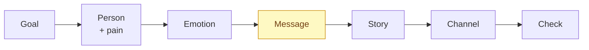

# Brand Storytelling — the process before the text

Core rule (the whole point): **do not ask AI to create — ask it to help think.**
AI as an *interviewer* and a *critic* beats AI as a *writer*. Good content is
architecture, not inspiration.

Never start with the text. Start with the goal and the person the text must
change.

## The method at a glance



Message-first: the message is fixed before the words, so the story serves a
point instead of decorating one.

## The message-first architecture

Walk this order every time. Skipping a step is `mettre la charrue avant les bœufs`.

```
Business goal      →  what does this need to achieve, in money/decision terms
Audience / persona →  ONE person, defined by pain (not demographics)
Problem + emotion  →  what hurts, what they fear, what winning feels like
Value              →  the change we deliver, in their words
Story              →  situation → trigger → obstacles → climax → resolution
Channel adaptation →  same story, re-cut per channel (LinkedIn ≠ site ≠ email)
Check + improve    →  critic pass before publishing
```

"I want more sales" is a goal for you, not a message for them. Translate every
business goal into a human sentence the reader feels as their own.

## Persona = a filter for decisions, not a pretty table

A persona named "Camille, 36 ans" creates the *illusion* of understanding.
Demographics rarely change the copy. **Pain does.** Capture instead:

- what actually hurts (the real problem, in their words)
- what they have already tried and why it failed
- why they did **not** buy last time (the real objection)
- what they are afraid of (losing money? looking foolish? wasting time?)
- what a win looks like for them
- who influences the decision (spouse, boss, peers)
- the proof they need before trusting

Two personas with the same age/job but opposite fears ("I'm afraid of losing
money" vs "I want to stand out") get completely different copy. That's the point.

## Story structure

Situation initiale → élément déclencheur → péripéties → climax → résolution.
For a professional/LinkedIn audience, a maturer variant reads better than AIDA:

`Observation → Problem → Non-obvious insight → Example → Practical lesson → Question`

Use AIDA only for beginner/simple funnels — it tends to produce plastic copy.

## AI as partner — the three prompt modes

Reach for these instead of "write me a post".

### Mode 1 — Interviewer (dig out the real story)
Do **not** generate yet. Ask one question at a time until the true story surfaces.

Template (FR, adapt language to project):
```
Tu es consultant senior en [personal branding / storytelling B2B / stratégie].
Contexte : [qui, marché, objectif].
Ne rédige rien pour l'instant.
Pose-moi UNE question à la fois pour découvrir :
1. mon fil rouge / positionnement ;
2. mes convictions fortes ;
3. les problèmes que je veux résoudre ;
4. mes preuves de crédibilité ;
5. les histoires personnelles utiles à mon audience ;
6. ce qui intéresse [cibles précises].
Après mes réponses, propose : un narratif central, 3 angles de storytelling,
5 idées de posts, et les objections possibles de l'audience.
```

### Mode 2 — Critic ("kill my draft") — the strongest use
Run every important piece through this BEFORE publishing.
```
Agis en critique adverse. Voici mon texte : [...].
Détruis-le : trouve les points faibles, les phrases creuses, le jargon,
les endroits où je parle de moi au lieu du client.
Quelles objections le lecteur va-t-il avoir ? Que va-t-il ne PAS croire ?
Où est-ce que je perds son attention ? Sois concret, pas gentil.
```

### Mode 3 — Repurposer (one story → many channels)
One story lives as: LinkedIn post, article, site page, email, short video,
sales one-pager. Re-cut per channel, never copy-paste. The LinkedIn audience is
not the site's Google audience — change the hook, angle, format.

## What NOT to blindly copy from generic "AI for business" courses

- Don't build demographic personas ("Camille, 36 ans") — build pain-based ones.
- Don't default to AIDA for a pro audience — it sounds plastic.
- Don't ask AI to "write the brand story" — ask it to interview you until it
  finds the real one.
- Don't treat an AI-generated persona as truth — it's a hypothesis. Validate it
  against real LinkedIn comments, client messages, reviews, job posts, analytics.

## Style rules

- Keep brand positioning in your project's own strategy/offer docs; this skill is
  the *pre-writing* layer above them.
- No em/en dashes in public copy; bilingual sites need both language versions in
  the same session; on LinkedIn the link goes in the first comment.

## Visual identity from a brief (client work)

When building a brand identity for a client, don't ask AI for "a logo". Ask for a
full system, with options to choose from:

```
Agis comme un expert en branding.
À partir de cette idée : [direction], aide-moi à construire une identité visuelle complète.
Détaille : le positionnement (cible, valeurs, image) ; l'univers de marque
(émotions, style, références) ; les éléments visuels (couleurs, typographies,
style graphique) ; des idées de logo cohérentes.
Propose 3 options sous forme de tableau ou moodboard.
```

Deliverables of a visual identity: colours (with hex codes) + typography
(titre / sous-titre) + palette + logo + graphic elements + chart/graphic style.
Colour advice: prefer **monochromatic or analogous** schemes over many hues.

## Responsible AI — verify, don't invent (all projects)

Two failure modes to guard against, always:

- **Bias / stereotypes.** AI averages its training data. Fix with *precise,
  specific* prompts, not generic ones. Not "a brand for women" but "a brand for
  women 45-60, small-business owners, who value intellectual aesthetics and quiet
  luxury, tired of loud marketing." Less generalisation = better output.
- **Hallucinations.** AI invents. Counter with: verify every claim, write detailed
  prompts, give reliable sources (the site, the research, the market analysis),
  and check the result before shipping. **If you can't see a file, don't invent —
  say so** (a standing honesty rule; matches Google's guidance).

Five réflexes before using AI on a task: (1) is AI right for THIS task? (idea /
research / structure / analysis = yes; legal contract, medical, financial audit =
only after a human checks); (2) do I have permission (employer policy)? (3) is the
data safe (never send client PII, internal docs, trade secrets, passwords)? (4) did
I verify the output? (5) am I transparent where AI materially contributed?

Meta-lesson of both Google webinars: **AI accelerates thinking; it does not replace
strategy.** Process beats magic prompts.

## Cross-model validation (positioning moat)

For important brand decisions (positioning, tone of voice, naming, slogan, visual
concept), run the SAME prompt through several models and take the best of each —
don't rely on one. Free tool for the FR context: **Compar:IA Arena**
(`comparia.beta.gouv.fr`), a French-government blind LLM comparison (Beta.gouv /
Ministère de la Culture). Blind = removes brand bias; tuned to French language and
culture. ⚠️ Never paste client PII/secrets there (see responsible-AI data rule).

For positioning as an AI-marketing expert, this is a differentiator: not
"j'utilise ChatGPT" but "j'applique une approche multi-modèles et je compare les
résultats de plusieurs LLM avant de décider." Credible and higher-quality.
