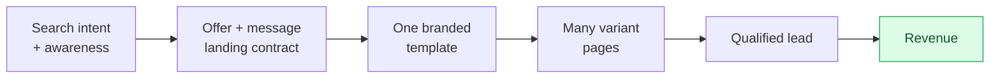

# build-multilanding

An Agent Skill for Claude Code, OpenAI Codex, and any tool that supports the
Agent Skills spec. It builds a **data-driven, multi-segment landing-page
system** from one branded template: one codebase, one design system, many
pages, each keeping one promise to one search intent.

Made for paid traffic that has to pay off. A generic page restarts the
conversation the ad began; this skill continues it, so each qualified lead
costs less and more clicks turn into orders.

## The method at a glance



One codebase, many pages, each keeping one promise to one intent, tracked all
the way to revenue.

## What it does

- Segments by **search intent + awareness stage + offer + message**, not by
  demographics.
- Keeps the project's real audiences, offers, and proof in the project (the
  fuel); the skill stays the method (the engine) and never invents facts.
- Enforces **message match**, a modular page composer (not a rigid template),
  **attribution to revenue** (not just form fills), consent-aware tracking,
  a per-variant indexation policy, and Core Web Vitals gates.
- Ships three zero-dependency Python scripts: input validation, variant-schema
  validation, and campaign/URL manifest generation.

## Install

Copy or link this folder into your agent's skills directory:

```bash
# Claude Code
cp -r build-multilanding ~/.claude/skills/
# OpenAI Codex
cp -r build-multilanding ~/.codex/skills/
```

On Windows you can link it once and share it between agents with a directory
junction pointing both `~/.claude/skills/build-multilanding` and
`~/.codex/skills/build-multilanding` at a single source folder.

Then start a new session and ask your agent to use `build-multilanding`.

## Structure

```
build-multilanding/
├── SKILL.md                     # the orchestrator (read first)
├── references/                  # method detail, loaded on demand
├── templates/                   # copy into your project's marketing/ context
│   └── product-marketing.md     # the strategic source of truth
└── scripts/                     # deterministic validation + manifest tools
```

Start with `SKILL.md`, then `references/worked-example.md` for the whole method
in miniature: one offer, three intents, three different pages.

## Author and license

Created by **Maryna Skachek** (MariCleo Studio), 2026. Released under the MIT
License (see `LICENSE`).

Some patterns (the shared product-marketing context convention, the intent
ladder, headline mirroring, switching-forces persona model) were informed by
the open-source [marketingskills](https://github.com/coreyhaines31/marketingskills)
project (MIT). Quality Score figures cited in the references are indicative
industry reports, not official platform guarantees; verify before quoting.
