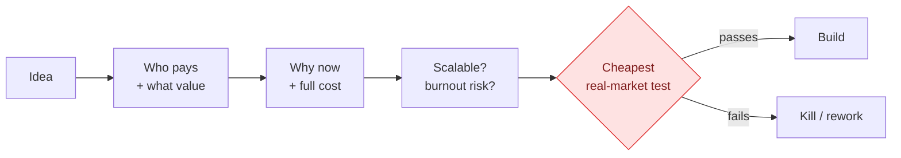

# Business and ROI Protocol

Evaluate an idea as a business before building it: who pays, for what value, why
now, and the cheapest real-market test.

**By [Maryna Skachek](https://maricleo-studio.vercel.app/) · MariCleo Studio**

Ten questions answered in writing before anyone builds anything, so an idea is
judged as a business and killed cheaply if it does not hold up.

**Full method → [SKILL.md](SKILL.md)**
