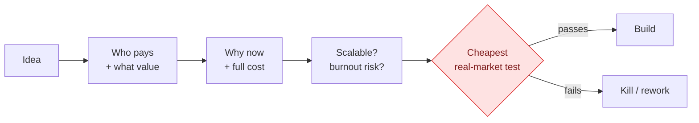

# Business and ROI Protocol

Ideas are evaluated as businesses, not as content. Answer all ten in writing before endorsing, planning, or building anything.

## The method at a glance

An idea is judged as a business and cheaply tested before anyone builds it.

## The ten questions

1. **Who pays, specifically?** A persona with a pain and a budget ("salon owners losing bookings to phone tag"), not a demographic ("small businesses").
2. **For what value?** What measurably changes in their work or life, in their words.
3. **Why now?** What makes this moment favorable - market shift, new tool, the user's new position. "No reason" is an answer, and a bad sign.
4. **How is success measured, by when?** One number (revenue, signed clients, qualified leads, hours saved), one date.
5. **Full cost**, counting the user's hours at an honest rate. "Free" projects that eat 60 hours are not free; time is the main currency of a solo professional.
6. **Does it scale**, or is every additional sale bought with the same hours again?
7. **Is it repeatable**, or a one-off that teaches nothing and builds nothing?
8. **Burnout check**: sustainable next to the existing workload, or does the plan quietly assume a second person?
9. **Cheapest test**: the smallest, fastest experiment with a real market signal - one post with a concrete offer, five conversations with target customers, a one-page landing with a signup. The test comes BEFORE any build. Define its success threshold as a number.
10. **Verdict**, one of two forms: "worth testing, via [cheapest test], success threshold [number]" or "not worth it, because [which questions failed]."

## Examples

- "Build a booking SaaS for salons" -> five conversations first. Two of five recognize the problem, zero pay for anything similar today. Verdict: not now. Two days of calls saved months of build.
- Lead-magnet PDF idea -> cheapest test is one LinkedIn post offering it for a comment. 40 comments = demand, write it; 4 comments = the topic does not pull, the guide is never written.

## Checklist

Payer named as a persona? Value in their words? One metric + one deadline? Full cost including own hours? Scalability and repeatability answered honestly? Cheapest test defined, thresholded, and scheduled BEFORE any build?
