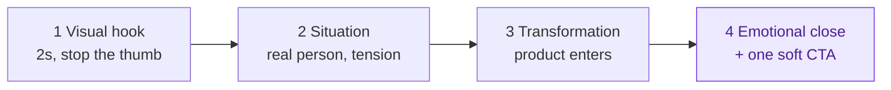

# Feel-First Framework

Short documentary-style brand video that makes the viewer feel the story before
they ever see the product.

**By [Maryna Skachek](https://maricleo-studio.vercel.app/) · MariCleo Studio**

A non-negotiable 4-scene arc (about 12 to 20 seconds), storyboard templates, and
a portable AI-video prompt library for Sora, Kling, Veo and others.

**Full method → [SKILL.md](SKILL.md)**
