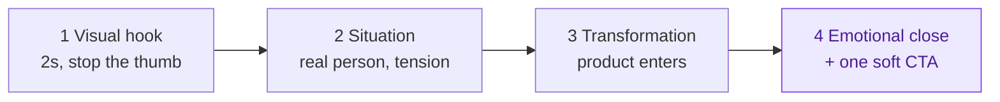

# Feel-First Framework (video brandbook + AI prompt method)

A complete method for short brand video that makes the viewer feel the story
before they ever see the product. This skill is the UNIVERSAL method:
brand-specific material (palette, personas, taglines) is always plugged in from
the CURRENT brand, never hardcoded here.

Companion files in this folder:

- [prompts.md](prompts.md) - portable AI-video prompt library (base formula, negatives, per-scene templates, per-tool cheat sheet, free-first)
- [storyboards.md](storyboards.md) - blank storyboard template + worked examples

## The arc at a glance

Feel first: the viewer feels the story before the product ever appears.

## 1. Philosophy

In a world saturated with images, Feel-First creates strong emotional impact by
combining narration, visual quality and sensory immersion. The viewer must be
able to say "I can imagine myself there". Feeling comes before product; the
product appears as the consequence of the story, never as the story itself.

Think like a documentarist with a marketing goal. Real moments, not staging.
Warmth, not gloss. One honest scene beats ten beautiful ones.

## 2. The 4-scene structure (the core, non-negotiable)

Every Feel-First video follows this arc (total ~12-20 s):

| Scene | Role | Length | Rule |
|---|---|---|---|
| 1 | Visual hook | 2 s | Strongest sensory image first. No logo, no text-heavy intro. If scene 1 does not stop the thumb, the video failed. |
| 2 | Situation / context | 4 s | A real person in a real place with a real tension or desire. Viewer recognizes themself. |
| 3 | Transformation / solution | 4 s | The change happens ON SCREEN, shown not told. Product enters here, as the enabler. |
| 4 | Emotional close + CTA | 2-6 s | Land the feeling (relief, pride, calm, joy), THEN one soft CTA. Never stack CTAs. |

Checkable rules: hook lands inside the first 2-3 s; ONE message per video; ONE
persona per video; ONE customer-journey stage per video (persona x stage
matrix, see section 3).

## 3. Persona x journey matrix

Before scripting, answer two questions: WHO is this for (one persona from the
CURRENT brand's persona set) and WHERE are they in the journey (discover /
consider / decide / after-sale). One video = one cell of that matrix. A video
"for everyone" is a video for no one.

If the brand has no documented personas yet, write 2-3 quick ones first (name,
age range, context, core desire, key message) and get the brand owner's
sign-off before producing video.

## 4. Script rules

- Hook in the first 2-3 seconds, sensory not verbal.
- One message. If a second idea appears, that is the next video.
- Human-centred arc: person -> tension -> change -> feeling. Product is the instrument.
- Brief but sensory narration: steam, light, textures, hands, human micro-expressions.
- Ambient sound and diegetic detail over voiceover; if voiceover is needed, keep
  it to one or two short warm sentences.
- On-screen text: minimal, subtitle-style, inside platform safe zones. No final
  period on titles/CTA lines. No em dashes in any client-facing text.

## 5. Camera and composition

- Subjective / POV camera and intimate framing: hands, shoulders, doorways, over-the-cup.
- Realistic camera moves only: slow push-in, handheld breathing, a restrained
  drone establishing shot. Believable motion, nothing showy.
- Hands doing things beat talking heads. Craft, gesture, touch.
- Recurring characters across a brand's videos build emotional brand identity.
- Authenticity cue in prompts: name the camera (ARRI Alexa 35, Sony FX3, 35mm lens).

## 6. Light and colour

- Natural light always: golden hour, window light, soft overcast. No studio-lit look.
- Warm authentic palette; grade toward the brand's own charte (plug in the
  CURRENT brand's colours, do not import another brand's palette).
- Hyperrealism: detailed textures (skin, fabric, wood, steam, dust in light).

## 7. Sound

- Ambient first: room tone, birds, a kettle, tools, footsteps. Real sound
  design sells reality more than music.
- If music: quiet, warm, no drops, no trending-audio gimmicks unless the
  platform strategy explicitly calls for it.
- Cut sound and image together at the key moment.

## 8. Editing

- Short-form rhythm tuned to the platform: fast enough to hold, slow enough to feel.
- Cut at the key moment, not on a beat grid.
- No artificial transitions (wipes, spins, glitches). A plain cut or a match cut.
- Restraint on motion graphics: subtitles and one soft end-card at most.
  Motion-design videos are a different tool; keep the two languages separate.

## 9. Do / Don't (the manifesto)

DO: real people over actors; natural light; everyday moments; POV intimacy;
slow believable movement; one emotion; sensory details; visual coherence across
site, social and ads.

DON'T: corporate stock footage; smiling stock models; show-off drone reels;
artificial transitions; motion-graphics overload; tech jargon; product-first
openings; multiple CTAs; faking metrics or moments that did not happen.

Privacy: blur licence plates, personal phone numbers, third-party faces and
readable documents in any real footage before publication.

## 10. Platform specs

| Platform | Format | Sweet spot | Notes |
|---|---|---|---|
| Instagram Reels | 9:16, 1080x1920 | 12-20 s | Captions on; hook without sound |
| TikTok | 9:16 | 12-25 s | Native feel matters most |
| YouTube Shorts | 9:16 | up to 30 s | Slightly slower rhythm tolerated |

Keep text inside safe zones (top ~15% and bottom ~20% reserved by UI). Design
for sound-off first viewing; sound rewards those who turn it on.

## 11. Website / UX extension

The same principle off-platform: immersive visuals instead of catalog shots,
Feel-First product photos, storytelling in product cards, emotional CTAs, a
feeling of presence instead of a catalog. Any page hero can be scene 1 of a
Feel-First story.

## 12. Production paths

1. **Real footage** (phone or camera): follow sections 4-8 directly; this is
   always the most authentic option when footage exists.
2. **AI generation** (free-first): build prompts with [prompts.md](prompts.md).
   The prompts are portable across Sora, Grok, Meta AI, Kling, Hailuo, Veo
   (Gemini) and Pika; free tiers cover most needs.
3. **Hybrid**: AI establishing shots + real close-ups, or real footage + AI b-roll.

## 13. Workflow (per video)

1. Pick brand -> persona -> journey stage -> one message (section 3).
2. Write the 4-scene storyboard using the template in [storyboards.md](storyboards.md).
3. Choose production path; if AI, generate the per-scene prompts from [prompts.md](prompts.md).
4. Assemble; check editing and sound rules (7-8).
5. Run the checklist below; show the brand owner the result FIRST, reasoning
   after; they sign off taste and message.
6. Bilingual brands: captions/text exist in both languages before "done".

## Checklist (before "done")

- [ ] Hook lands in 2-3 s, sensory, no logo-first
- [ ] One persona, one journey stage, one message
- [ ] 4-scene arc complete, product enters only in scene 3
- [ ] Natural light, believable motion, no stock look
- [ ] Sound: ambient-first, cut at the key moment
- [ ] No artificial transitions, minimal graphics
- [ ] Text in safe zones, no final periods on titles/CTA, no em dashes
- [ ] Privacy blur done (plates, phones, third parties)
- [ ] Any claimed metric about past results marked self-reported unless verified
- [ ] Both languages if the brand is bilingual

## Provenance

Method authored by Maryna Skachek (MariCleo Studio), formalized from her
Chef de projet e-commerce diploma work (2025) and refined in production across
service, travel and local-business brands.
