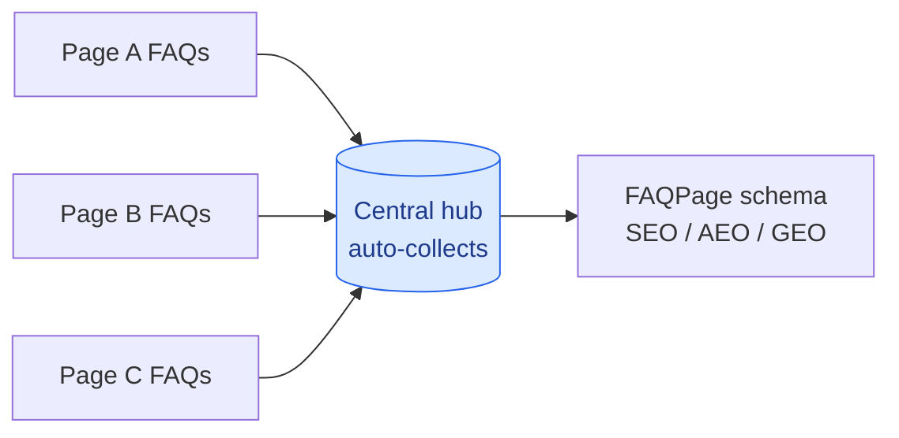

# FAQ Hub

Auto-aggregating FAQs: each page declares its own, a central hub collects them,
with FAQPage schema for search and AI answers.

**By [Maryna Skachek](https://maricleo-studio.vercel.app/) · MariCleo Studio**

No manual upkeep: add an FAQ on any page and it appears on the hub automatically.
Working WordPress mu-plugin plus a build-time recipe for static sites.

**Full method → [SKILL.md](SKILL.md)**
