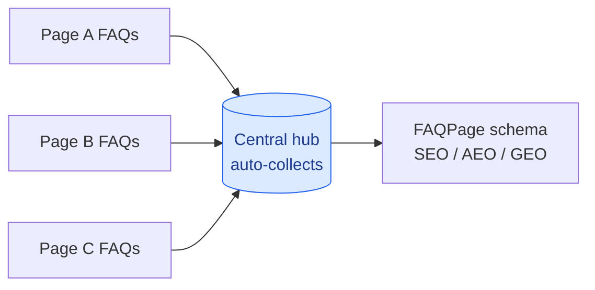

# FAQ Hub (auto-aggregating FAQs)

Why: FAQs with FAQPage schema are high-value for SEO, AI answer engines (ChatGPT/Perplexity/
Gemini), and conversion (they remove buying friction). The pain is upkeep - keeping a central FAQ
page in sync. This system fixes that: each page declares its own FAQs inline, and the central hub
**auto-collects** them. Add an FAQ on any page -> it appears on the hub automatically.

## The method at a glance

Each page declares its own FAQs inline; the hub collects them automatically, with
FAQPage schema for search and AI answers.

## WordPress (mu-plugin) - the auto path
Drop `scripts/faq-hub.php` into `wp-content/mu-plugins/` (deploy via the project's safe method,
for example `$wpdb` / WP-CLI, never the kses editor). Then:

- **Add an FAQ to ANY page/post** (in its content):
  `[faq q="Question?"]Answer HTML, links allowed.[/faq]`
  Renders a styled `
` accordion on that page + emits FAQPage JSON-LD.
- **Central hub** (e.g. on /faq/): place `[faq_hub]`. It scans all published pages for
  `[faq]`, renders them grouped by page (each group an accent card with a "More on <page> ->"
  back-link = internal interlinking), and emits combined FAQPage JSON-LD. 1-hour transient cache,
  auto-cleared on save_post.
- Group headings are accent-coloured and carded so the hub stays scannable as it grows (not one
  long list). Titles are sanitised (em/en dashes -> hyphen) per the no-em-dash rule.

Rebrand if wanted: recolour the CSS tokens to the brand; rename the `faq`/`faq_hub` shortcodes and
the `faq` CSS prefix per project. Otherwise it works as-is.

## Static sites (e.g. a static site on Vercel) - the build path
A static site can't scan pages at runtime. Replicate the idea at BUILD time: keep each page's FAQs
in a small data file (or front-matter), and a build step concatenates them into the hub page +
generates FAQPage JSON-LD. Same authoring model (declare once per page), aggregation happens at
build instead of runtime. (This is why "auto" is not possible inline on a purely static HTML site -
it needs a build step, not a server plugin.)

## Where to add FAQs (pick by search intent)
Add FAQs where users actually have questions / where it targets search queries: money/booking
pages (reserve, pricing), practical pages (how to get there, what to pack), each product/service
page, and journal/blog articles (article-specific FAQs help long-tail SEO and AI answers). Keep
answers honest and specific; no invented facts. UK English, no em-dashes.

## Reference implementation
`scripts/faq-hub.php` here is the working mu-plugin, ready to drop in.
