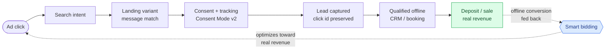

# 🎯 Reusable Google Ads Launch Framework

A case study. The methodological frame is shown here; client configurations,
operational mechanisms, and production data stay confidential. This is the one
framework in this toolkit published as a method overview rather than as a full
skill, on purpose.

**By [Maryna Skachek](https://maricleo-studio.vercel.app/) · MariCleo Studio**

> Le cadre methodologique est presente ici. Les configurations clients, les
> mecanismes operationnels et les donnees de production restent confidentiels.

## Context

Most paid-ad budgets do not die in the auction. They die in the gaps between five
systems that never talk to each other: the landing pages, the analytics and
consent layer, the CRM, the ad account, and the payment or booking system. Every
launch gets re-improvised across those gaps. Someone forgets one tracking step,
spend starts flowing before anyone can trust the numbers, and a month later the
only honest answer to "what worked?" is a shrug with a dashboard behind it.

## Objective

Turn a launch from an act of heroism into a fill-in-the-blanks operation: a
reusable system that cuts preparation time and makes it structurally difficult
to spend money on traffic nobody is measuring.

## The chain the framework protects

It is a loop, not a line: the real downstream revenue is fed back so bidding
optimizes toward paying customers, not the cheapest form fill. Every arrow is a
place a launch usually breaks, and the framework makes each one a contract with
an acceptance test.

## Architecture: one engine, project-specific fuel

The method is the engine: contracts, gates, verification, checklists. It never
changes and it never stores a client's data. Each project brings its own fuel:
audiences, offers, conversion values, proof. The engine without fuel does
nothing; the fuel without the engine burns.

Every rule in the framework carries a label, so an agency habit can never dress
up as a law of the platform:

- **[PLATFORM]** a Google-supported requirement, backed by an official source
- **[DEFAULT]** an agency default or guardrail, override it with a reason
- **[PROJECT]** a per-project decision: budget, vertical, demand, deadline

That one distinction removes an entire class of expensive folklore, the "always
do X" rules that were true for one account in one year and then got repeated
forever.

## Core modules

Conversion goals, event map, consent contract, click attribution, campaign
manifest, tracking QA, ownership map, and a go/no-go runbook. Each module is a
contract with its own acceptance tests, and each composes with the analytics and
consent layers instead of duplicating them. Nothing launches on "it seems set
up": a test lead has to be visible in the ad account before the first euro of
spend.

## Trust system

Platform claims are verified against primary Google sources, never repeated from
memory and never accepted because several AI assistants agree. That last rule
earned its place: during the build, a bidding-strategy claim endorsed by three
assistants turned out to be inverted against Google's own documentation. It read
plausibly, it was confidently phrased, and it was backwards. Verification caught
it before it could fossilize into the framework. Consensus is not a source; a
document is.

Unverified items stay visibly marked as unverified. A gap in the data remains a
visible gap, not a plausible guess wearing a suit.

## Validation

Before the framework was declared ready, it was checked the way production code
is checked: YAML parsing, cross-reference resolution across every file, a
contradiction scan for stale rules, and source verification of the platform
claims. Declaring a system reusable is easy; proving its files agree with each
other is the part that counts.

## What is deliberately not shown

Client values and current weaknesses, budgets and conversion values, campaign URL
manifests, CRM structure and live statuses, internal file paths, private
operational skills, and the exact reproducible instructions. Those remain part of
MariCleo Studio's internal methodology. A portfolio should show the level of
thinking, not hand over the working machine.

See [`demo/`](demo/) for a fictional, illustrative fragment of one module.

## Business result of the system

Stated honestly, without promising a cheaper click that only data can prove:
launches become shorter and repeatable, the chain from ad click to real business
outcome becomes measurable end to end, and every gate has a named owner, so a
launch stops depending on one person remembering every step. The competitive
edge stays private. The discipline is what is on display here.
