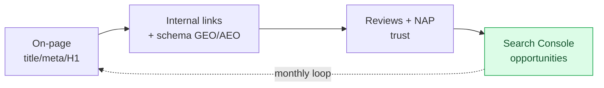

# SEO Optimization Protocol

Universal, project-agnostic method. Site-specific data (keywords, URLs, personas, business name, phone, service zone) lives in the PROJECT's own context (project CLAUDE.md / docs / memory), never in this skill.

## The method at a glance

Not a one-off: a monthly loop that turns Search Console data back into on-page fixes.

## Honesty rules (SEO is full of folklore)

- Mark every claim: **Confirmed** (Google-documented / observed on the live site), **Derived** (reasonable inference), **Assumed**, **Unknown**. Do not parrot magic numbers ("keyword density 2.7%", "max 5-7 links") as law.
- Verify on the LIVE site, not from memory: `curl -s https://SITE/page | grep -oiE "marker"`. A local file is a hint, the deployed page is the truth.
- Never invent what you cannot see (a screenshot, a ranking, a competitor's setup). Say "Unknown, need the source."

## Persona-first foundation (do BEFORE writing any page)

Good SEO starts from the reader, not the keyword. For each page define: WHO lands here, their 3 concrete PAINS in their own words, HOW the business solves each, and only THEN the keywords that persona would actually type. Wrap the whole page around those pains. Reusable prompt: `assets/prompt-persona-content.md`.

## Topical architecture: mother pages + child pages (not a blog)

Build the site as query-driven clusters, not as a blog:
- **One MOTHER (pillar) page per real client query**, phrased the way a client would ask it ("разработка сайта под ключ", "site internet sur mesure", "réservation directe gîte"). This page targets that query's cluster.
- **CHILD pages accumulate around each mother page and link UP to it.** More quality child pages linking to the mother = richer semantic core = stronger ranking for that cluster.
- The semantic core grows from real client QUERIES, which come from the PERSONA (see below), not from guesswork.
- **This is NOT a blog.** A blog reads as dated. Use "actualités" (news) only for what is genuinely current/hot now; evergreen depth belongs in the mother/child cluster, not in a chronological blog feed.

## On-page essentials

| Element | Rule |
|---|---|
| Title | Criterion #1. 1 primary keyword + brand + geo, ~55-60 chars. Unique per page. No final period. |
| Meta description | primary + benefit + soft CTA, ~150-160 chars. |
| H1 | EXACTLY one per page, and it must be the FIRST/top heading (never an H2 or H3 above it). Primary keyword in natural form, no final period. Keep hierarchy shallow (avoid H5/H6). |
| First 100 words | primary keyword + one geo/segment term, naturally. |
| H2/H3 | 2-4 semantic keywords, structure for skim-reading. |
| Body | write for a human; Google understands variants, no keyword-stuffing. |
| URL slug | short, descriptive, hyphenated. |
| Alt text | describe the image, do not spam keywords (see web-images skill). |

## Front-load the key term (lists and paragraphs)

Lead with the keyword, then explain. In **bullet/numbered lists**, start each item with the main term (ideally bold), then the explanation: "**Direct booking** saves the commission a platform would take." NOT "You save money because of direct booking." Same for **paragraph openings**: the first few words of a paragraph should carry the key term, then unpack it. This helps skim-reading, featured snippets, and LLM extraction (the answer engine grabs the leading term + definition). Confirmed direction; do not keyword-stuff, one clear term per item.

## Internal linking and anchors

- **Anchor text = the visible clickable text.** Google reads it to understand the target page. Use descriptive keyword anchors ("Découvrir le SEO local"), NEVER "click here / learn more / en savoir plus" on buttons and links - that throws away a free signal.
- **Click depth ≤ 3**: any important page reachable within 3 clicks of the home page.
- Internal links pointing TO a page STRENGTHEN it. Do not artificially cap inbound internal links to a key/money page - more is generally better (Confirmed principle). Folk rules like "max 5-7 links to the mother page" are Unknown/unverified; the defensible readings are "keep the nav menu to ~5-7 items" or "don't dump dozens of links on one page." Don't cut useful internal links to hit a number.

## Structured data (schema / JSON-LD) - for Google AND LLMs

Same practices power classic results, AI Overviews and LLM answers (GEO/AEO): page indexable, key content as real text, structured data that MATCHES the visible text, entity of the business clear. Add JSON-LD: Organization, LocalBusiness/ProfessionalService, Service, FAQPage, BreadcrumbList, Article. Verify it renders on the live page and matches on-page text.

## Images: real and original over stock/AI-generated

- Prefer **real, original, relevant photos** (of the actual person, team, work, place) over stock and AI-generated images. Rationale is **EEAT + trust + conversion**, and originality is a people-first signal Google rewards (Confirmed direction). For a personal brand or local business, a real photo of the founder/work strongly supports "Experience" and Trust.
- ⚠️ Honesty marker: the stronger claim that "AI-generated images actively kill/penalize rankings" is **Unknown/unverified** - Google's stated position is it judges by quality/helpfulness/originality, not by production method. So treat "use real photos" as a well-founded recommendation, not a documented ranking penalty. Do not overstate it in client-facing advice.
- Practical: at least the hero, about page, and key service/proof pages should carry real imagery. A site with zero real photos reads as generic to both users and Google.
- Format/alt/performance rules live in the `web-images` skill. Privacy: by default blur license plates, third-party faces, phone numbers before publishing (global CLAUDE.md privacy rule).

## FAQ and long-tail

Long-tail, question-form queries belong in FAQ sections (also feeds FAQPage schema and AI answers). See the `faq-hub` skill for the auto-aggregating FAQ system. 4-6 real questions per key page.

## Social proof: real reviews, not copy-paste

- Pull REAL Google reviews via a widget/embed (e.g. Trustindex "Widgets for Google Reviews"), not hand-copied quotes. Prerequisite: claim the Google Business Profile.
- **Platform check before choosing a tool**: a WordPress plugin only works on WordPress. For a static/JS site (Vercel/Next, plain HTML) use the tool's JS embed, not the WP plugin.
- **Placement**: put social proof near the offer / before the main CTA, not only a carousel in the footer where few visitors reach.
- **Keywords in reviews matter**: when asking clients for a review, gently prompt them to mention the service and city ("your service", "your city", "local SEO"). A review without keywords is a missed signal.
- **Never incentivise reviews** (discount/gift in exchange for a review) — prohibited by Google and Trustindex. Only ask + make it easy (direct "write a review" link, e.g. `g.page/r/<id>/review`).
- **Trustindex mechanics (verified in production, 2026)**: the embed is a stable `<script defer async src="https://cdn.trustindex.io/loader.js?WIDGET_ID">` — the **widget-id/code does NOT change** when reviews update, so it's a one-time paste on the site. On the **free plan there is NO automatic update**: to pull NEW reviews you must manually re-sync in "Get reviews" (or disconnect → reconnect the Google source in the dashboard); then the same embedded widget shows the new count. A "professional" widget/feature (verified badge, auto-update, unlimited impressions, rich-snippet) is **free only 7 days, then reverts to the free package (it does NOT break)**. Free plan has an impression cap — place the full slider on key pages (home + near CTA) + a light badge in the footer, not on all 50 pages. The widget renders only on the registered live domain, **not on localhost** (can't preview locally; verify on the deployed site). Rich-snippet/schema in Trustindex is paid — and self-serving AggregateRating for a business's own reviews on its own site is ignored by Google anyway, so skip it.

## NAP consistency (Name, Address/zone, Phone, Social)

Google trusts a business whose identity matches everywhere. Define ONE canonical version (exact name, phone format, service-zone wording, official social URLs) and make it identical across: site footer, contact page, legal pages, Google Business Profile, LinkedIn, Instagram, directories, email signature. Reusable prompt: `assets/prompt-nap-audit.md`.

## Human-readable sitemap page

Besides the XML sitemap (submitted in Search Console), publish a visible "plan du site" page listing all pages - helps users and crawling. On bilingual sites make both versions (`/plan-du-site` + `/en/sitemap`) and link them.

## Gated lead magnets - do NOT expose the reward (all projects)

If a lead magnet is email-gated (the download is the reward for leaving an email), the **reward file itself** (PDF/zip/download) must stay BEHIND the capture. Do NOT expose it via: the human-readable sitemap page, the XML sitemap, a descriptive internal link/button that hands it out, or a directly-downloadable indexable URL. Only the **landing/capture page** is public and linkable; the reward is delivered AFTER the email is submitted (email delivery, or a token/redirect the public page does not reveal).
- When building the human-readable sitemap or internal-linking clusters, list the capture page, never the reward file. Auto-listing "all pages/files" will leak `/assets/lead-magnets/*.pdf` - exclude it explicitly.
- ⚠️ Verify live, don't trust notes: if the PDF currently downloads directly with no email step, the gate is NOT implemented yet - flag it as a gap, do not treat the reward page as a normal article to link.

## Search Console opportunity loop (monthly, after data accrues)

Do not guess keywords - mine Search Console for real opportunities. A new site needs a few weeks of data first. Each month look for:
- queries where the site already appears, especially **positions ~4-20** (cheapest to push into the top);
- pages with **high impressions but low CTR** (Google finds them relevant, but the title/snippet or answer is weak - often the cheapest wins);
- queries where a page shows but the content answers weakly;
- pages losing clicks/positions; indexing problems.

Then: real queries -> improve Title, H1/H2, FAQ, content -> re-check next month. A read-only Search Console connector plus a no-keys keyword-idea harvester can live in your project toolkit.

## Bilingual sites (hard rule)

If the site is bilingual (FR + EN etc.), every new page/article must exist in BOTH languages at once, mirror URLs, hreflang (fr/en/x-default) on both, a language switcher to the exact counterpart, and both in the sitemap. A one-language page is not "done." (Global CLAUDE.md rule.)

## Style guardrails for SEO copy

No em-dashes in public copy. Titles / H1-H3 / CTAs / slogans without a final period. Write like a human, no corporate filler. French copy -> french-pro-writing skill.

## Pre-launch SEO checklist

- [ ] Unique Title + Meta on every page; no final period on Title/H1
- [ ] One H1 per page; heading hierarchy sane
- [ ] Descriptive keyword anchors; no "click here"; click depth ≤ 3
- [ ] JSON-LD schema present on live pages, matches visible text
- [ ] FAQ with long-tail questions on key pages
- [ ] XML sitemap + robots.txt correct and submitted in Search Console (verify live: 200, valid XML)
- [ ] Human-readable sitemap page (does NOT expose gated lead-magnet reward files)
- [ ] NAP identical everywhere; Google Business Profile claimed
- [ ] Real-reviews widget near CTA (right tool for the platform)
- [ ] Bilingual pairs complete with hreflang + switcher
- [ ] Real/original photos on hero + key pages (not zero real imagery); privacy-blurred
- [ ] Images optimized (web-images skill)
